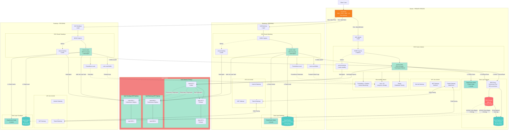

```mermaid
flowchart TD

%% ===== CLIENT & CLOUDFLARE =====
Client[Client / User]
CF[CloudFlare<br/>DNS + CDN + WAF + LB<br/>Geo-steering]
Client --> CF

%% ===== VAULT CLUSTER (HA + DR) =====
subgraph VAULT["Vault Cluster"]
  direction TB
  
  subgraph VAULT_JKT["Vault Jakarta (Primary)"]
    V_JKT_1[Vault-JKT-1<br/>Leader]
    V_JKT_2[Vault-JKT-2<br/>Follower]
    V_JKT_3[Vault-JKT-3<br/>Follower]
    
    V_JKT_1 --- V_JKT_2
    V_JKT_2 --- V_JKT_3
  end
  
  subgraph VAULT_BDG["Vault Bandung (DR Replica)"]
    V_BDG_1[Vault-BDG-1<br/>Performance Replica]
    V_BDG_2[Vault-BDG-2]
  end
  
  subgraph VAULT_SBY["Vault Surabaya (DR Replica)"]
    V_SBY_1[Vault-SBY-1<br/>Performance Replica]
    V_SBY_2[Vault-SBY-2]
  end
  
  V_JKT_1 -.Raft Replication.-> V_JKT_2
  V_JKT_1 -.Performance Replication.-> V_BDG_1
  V_JKT_1 -.Performance Replication.-> V_SBY_1
  V_BDG_1 --- V_BDG_2
  V_SBY_1 --- V_SBY_2
end

%% ===== JAKARTA PRIMARY =====
subgraph JKT["Jakarta - PRIMARY REGION"]
  
  JALB[ALB Jakarta<br/>+ WAF]
  
  subgraph NET_JKT["VPC 10.4.0.0/16"]
    IGW_JKT[Internet Gateway]
    NAT_JKT[NAT Gateway<br/>Multi-AZ]
    TGW_JKT[Transit Gateway<br/>Attachment]
  end

  subgraph JEKS_CLUSTER["EKS Cluster Jakarta"]
    direction TB
    JMS[service-main<br/>HPA 4-20 pods<br/>+ Vault Agent Sidecar]
    JBS[service-backup<br/>2 pods standby]
    JING[NGINX Ingress<br/>3 replicas]
  end
  
  subgraph JDATA["Data Layer Jakarta"]
    JREDIS[ElastiCache Redis<br/>Cluster Mode<br/>6 shards]
    JProxy[RDS Proxy<br/>Connection Pool<br/>500 connections]
    JDB[(RDS Primary<br/>Multi-AZ<br/>db.r6g.2xlarge)]
    JREAD[(Read Replica 1-3<br/>Same Region<br/>db.r6g.xlarge)]
  end
  
  subgraph JOBS["Observability Jakarta"]
    JPROM[Prometheus + Grafana<br/>Central Monitoring]
    JLOKI[Loki + S3<br/>Long-term Storage]
    JTEMPO[Tempo<br/>Distributed Tracing]
  end
  
  %% Connections Jakarta
  CF -->|Geo: Jakarta/Banten| JALB
  JALB --> JING
  JING --> JMS
  JING -.failover.-> JBS
  
  JMS -->|1. Check Cache| JREDIS
  JMS -->|2. Write + Critical Read| JProxy
  JMS -->|3. Eventual Read| JProxy
  JProxy --> JDB
  JProxy --> JREAD
  
  JMS -->|Vault Agent Injector| V_JKT_1
  JBS -->|Vault Agent| V_JKT_1
  
  JEKS_CLUSTER --> JPROM
  JEKS_CLUSTER --> JLOKI
  JEKS_CLUSTER --> JTEMPO
end

%% ===== BANDUNG REGIONAL =====
subgraph BDG["Bandung - REGIONAL"]
  
  BALB[ALB Bandung<br/>+ WAF]

  subgraph NET_BDG["VPC 10.5.0.0/16"]
    IGW_BDG[Internet Gateway]
    NAT_BDG[NAT Gateway]
    TGW_BDG[Transit Gateway]
  end

  subgraph BEKS_CLUSTER["EKS Cluster Bandung"]
    direction TB
    BMS[service-main<br/>HPA 3-12 pods<br/>+ Vault Agent]
    BBS[service-backup<br/>2 pods]
    BING[NGINX Ingress]
  end
  
  subgraph BDATA["Data Layer Bandung"]
    BREDIS[ElastiCache Redis<br/>4 shards]
    BREAD[(Read Replica<br/>ASYNC from Primary<br/>db.r6g.large)]
  end
  
  BPROM[Prometheus Local]
  BLOKI[Loki Local Buffer]
  
  %% Connections Bandung
  CF -->|Geo: Jawa Barat| BALB
  BALB --> BING
  BING --> BMS
  BING -.failover.-> BBS
  
  BMS -->|1. Check Cache| BREDIS
  BMS -->|2. Read Local| BREAD
  BMS -->|3. Write via API| JMS
  
  BMS -->|Auth via Local Vault| V_BDG_1
  BBS -->|Vault Agent| V_BDG_1
  
  BEKS_CLUSTER --> BPROM
  BEKS_CLUSTER --> BLOKI
  
  BPROM -.Prometheus Federation.-> JPROM
  BLOKI -.Forward Critical Logs.-> JLOKI
end

%% ===== SURABAYA REGIONAL =====
subgraph SBY["Surabaya - REGIONAL"]
  
  SALB[ALB Surabaya<br/>+ WAF]
  
  subgraph NET_SBY["VPC 10.2.0.0/16"]
    IGW_SBY[Internet Gateway]
    NAT_SBY[NAT Gateway]
    TGW_SBY[Transit Gateway]
  end

  subgraph SEKS_CLUSTER["EKS Cluster Surabaya"]
    direction TB
    SMS[service-main<br/>HPA 3-12 pods<br/>+ Vault Agent]
    SBS[service-backup<br/>2 pods]
    SING[NGINX Ingress]
  end
  
  subgraph SDATA["Data Layer Surabaya"]
    SREDIS[ElastiCache Redis<br/>4 shards]
    SREAD[(Read Replica<br/>ASYNC<br/>db.r6g.large)]
  end
  
  SPROM[Prometheus Local]
  SLOKI[Loki Local Buffer]
  
  %% Connections Surabaya
  CF -->|Geo: Jawa Timur| SALB
  SALB --> SING
  SING --> SMS
  SING -.failover.-> SBS
  
  SMS -->|1. Check Cache| SREDIS
  SMS -->|2. Read Local| SREAD
  SMS -->|3. Write via API| JMS
  
  SMS -->|Auth via Local Vault| V_SBY_1
  SBS -->|Vault Agent| V_SBY_1
  
  SEKS_CLUSTER --> SPROM
  SEKS_CLUSTER --> SLOKI
  
  SPROM -.Federation.-> JPROM
  SLOKI -.Forward Logs.-> JLOKI
end

%% ===== DATABASE REPLICATION =====
JDB -->|SYNC Multi-AZ<br/>~1ms lag| JREAD
JDB -.ASYNC Cross-Region<br/>2-5s lag.-> BREAD
JDB -.ASYNC Cross-Region<br/>2-5s lag.-> SREAD

%% ===== TRANSIT GATEWAY MESH =====
TGW_JKT <-->|TGW Peering| TGW_BDG
TGW_JKT <-->|TGW Peering| TGW_SBY
TGW_BDG <-->|TGW Peering| TGW_SBY

NET_BDG --> TGW_BDG
NET_SBY --> TGW_SBY

%% ===== STYLING =====
style CF fill:#f6821f,color:#fff
style VAULT fill:#f38181,color:#fff
style VAULT_JKT fill:#a8e6cf,color:#000
style VAULT_BDG fill:#a8e6cf,color:#000
style VAULT_SBY fill:#a8e6cf,color:#000
style JDB fill:#ff6b6b,color:#fff
style JREAD fill:#4ecdc4,color:#fff
style BREAD fill:#4ecdc4,color:#fff
style SREAD fill:#4ecdc4,color:#fff
style JREDIS fill:#95e1d3
style BREDIS fill:#95e1d3
style SREDIS fill:#95e1d3
style JMS fill:#a8e6cf
style BMS fill:#a8e6cf
style SMS fill:#a8e6cf
```